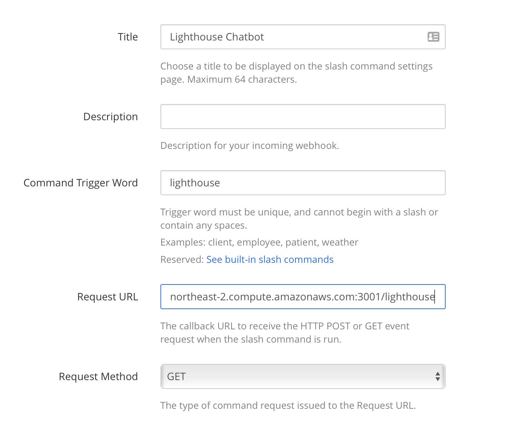

# Lighthouse Auditing Bot   |    


## Summary
This project seeks to provide added value to the Mattermost ecosystem by adding performance auditing of websites with Google's [Lighthouse](https://developers.google.com/web/tools/lighthouse), offering a testing environment that is accessible directly from any Mattermost channel.


## Features

* __Ad-hoc Auditing__ - Quickly run an audit of a website with the `/lighthouse {url}` command, or simply type `/lighthouse` to launch a dialog with all available options
* __Job Scheduling__ - With the `/lighthouse jobs` command, you can schedule an auditing job to be run whenever necessary
* __Authentication Scripting__ - When auditing a website that requires an authenticated user, run your audit with an authentication script that will be injected into puppeteer at run-time (more information in [the auth tutorial](#tutorials))
* __Customizeable HTML Reports__ - Always be able to view the full detailed report from Lighthouse as an HTML file, which is provided by a template in this project, and customize parts of the template (in `src/static/reportTemplate.html`) to your heart's content!
* __Trend Charts__ - Track changes in each of the audit categories over time for a given URL by running the `/lighthouse stats {url}` command and clicking the link to an intuitive dashboard (also provided as an HTML template that can be customized in `src/static/statsTemplate.html`)

## Development
### Pre-requisites & Notes

* **Node.js v10+**

* **Mattermost v5.20+**

* **[Create a Bot Account](https://docs.mattermost.com/developer/bot-accounts.html#user-interface-ui), or [issue a Personal Access Token](https://docs.mattermost.com/developer/personal-access-tokens.html#creating-a-personal-access-token) in a Mattermost server of your choice**

NOTE: Since this bot relies on sending ephemeral messages through Mattermost's API, the account you're using __MUST__ have `System Admin` permissions

* **Used environment variables**  
Regardless of the method you are deploying with, this application relies on a variety of environment variables to be able to function properly. Either use the `export` method, or inject your docker container with env variables depending on what method you are deploying this chatbot with.

| Variable name | Example value | Explanations / Notes |
| --: | :-- | :-- |
| PORT | 3001 | The port being used by this chatbot |
| MATTERMOST_SERVER | http://192.168.1.10:8065 | The Mattermost instance you are using |
| TOKEN | sd67j1cxepnc7meo3pof3krzgr | A Personal Access Token or Bot Account Token |
| MONGO_USERNAME | root | Auth username for a mongodb server |
| MONGO_PASSWORD | test_passwd | Auth password for a mongodb server |
| MONGO_SERVER | 192.168.1.10:27017 | The endpoint for a mongodb server |
| CHATBOT_SERVER | http://192.168.1.10:3001 | IP to be used by this chatbot (needed to set URL endpoints in Message Attachments) |
| TZ (optional) | Asia/Seoul | The timezone value that will be used on server (important for job scheduling) |

### Developing with Docker
**0. Build local Lighthouse bot image** (optional)
```
docker build -t avasconcelos114/lighthouse-bot .
```

**1. Run mongodb (as a separate container)**  
```
docker run -d -p 27017:27017 -e MONGO_INITDB_ROOT_USERNAME="root" -e MONGO_INITDB_ROOT_PASSWORD="test_passwd" --name lighthouse-mongo mongo:latest
```

**2. Run Lighthouse bot container**  
Note: Ensure you have the environment variables set when running the container  
  
Example `run` command:
```
docker run -d -p 3001:3001 -v $PWD/src:/home/app/src -e TZ="Asia/Seoul" -e PORT=3001 -e MATTERMOST_SERVER="http://192.168.1.129:8065" -e TOKEN="sd67j1cxepnc7meo3prf3krzgr" -e MONGO_USERNAME="root" -e MONGO_PASSWORD="test_passwd" -e MONGO_SERVER="192.168.1.129:27017" -e CHATBOT_SERVER="http://192.168.1.129:3001" --name lighthouse-bot avasconcelos114/lighthouse-bot
```

**3. [Register a slash command](https://docs.mattermost.com/developer/slash-commands.html#custom-slash-command) in Mattermost that sends a `GET` request to the `/lighthouse` endpoint**  


### Developing with PM2
**0. Follow the [installation guide for MongoDB](https://docs.mongodb.com/manual/installation/) to set up your MongoDB instance** 
  
**1. Set values for all required environment variables**  
```
export PORT=3001
export MATTERMOST_SERVER=http://192.168.1.10:8065
export TOKEN=sd67j1cxepnc7meo3pof3krzgr
export MONGO_USERNAME=root
export MONGO_PASSWORD=test_passwd
export MONGO_SERVER=192.168.1.10:27017
export CHATBOT_SERVER=http://192.168.1.10:3001
export TZ=Asia/Seoul
```

**2. Globally install [PM2](https://pm2.keymetrics.io)**  

```
npm install -g pm2
```

**3. Install dependencies**  
```
npm install
```

**4. Run chatbot with pm2**  
```
pm2 start ecosystem.config.js
```

**5. [Register a slash command](https://docs.mattermost.com/developer/slash-commands.html#custom-slash-command) in Mattermost that sends a `GET` request to the `/lighthouse` endpoint**  


## Deployment
Deploying this chatbot is done in the same way as the [development environment setup](#development), with the exception that you would set the `NODE_ENV` variable to `production`, as well as not do any volume binding to the host when running the chatbot with Docker.

## Tutorials  
While typing `/lighthouse help` provides you with a list of available commands for the Lighthouse chatbot, below are a few step-by-step tutorials that may help you with the most important aspects of using this chatbot.  

* [Performing ad-hoc tests](documentation/recipes/ad-hoc.md)
* [Scheduling audit jobs](documentation/recipes/scheduling.md)
* [Authentication Scripting](documentation/recipes/auth-scripting.md)
* [Viewing Audit Trends](documentation/recipes/audit-stats.md)


## Troubleshooting
* The audit command fails with an `error while loading shared libraries: libX11-xcb.so.1: cannot open shared object file: No such file or directory` error on Ubuntu
  * Run the command below to install dependencies needed to launch Puppeteer from your host

  ```
  sudo apt install -y gconf-service libasound2 libatk1.0-0 libc6 libcairo2 libcups2 libdbus-1-3 libexpat1 libfontconfig1 libgcc1 libgconf-2-4 libgdk-pixbuf2.0-0 libglib2.0-0 libgtk-3-0 libnspr4 libpango-1.0-0 libpangocairo-1.0-0 libstdc++6 libx11-6 libx11-xcb1 libxcb1 libxcomposite1 libxcursor1 libxdamage1 libxext6 libxfixes3 libxi6 libxrandr2 libxrender1 libxss1 libxtst6 ca-certificates fonts-liberation libappindicator1 libnss3 lsb-release xdg-utils wget
  ```

## Hackfest Proposal
This project has been created as a submission to the Mattermost Bot Hackfest.

You can [read the full Hackfest Proposal here](/documentation/README.md)

### Current Tasks
- [x] Implementing trend charts for audit results to be accessed with `/lighthouse stats {url}`
- [x] Styling audit trends dashboard 
- [x] Add usernames to schedule schemas so that they can be easily viewed through `/lighthouse schedule list`
- [x] Implementing `/lighthouse schedule info {id}` to get full details of a given job
- [ ] Add unit testing with Jest or AVA
- [x] Write documentation to make command usage clearer
- [x] Add more comprehensive logging
- [x] Investigate the possibility of using workers to run audits so that multiple audits can run simultaneously
- [x] Add a configurable number of past audits to be fetched from `stats` command
  - e.g. `/lighthouse stats https://google.com limit 15` 
