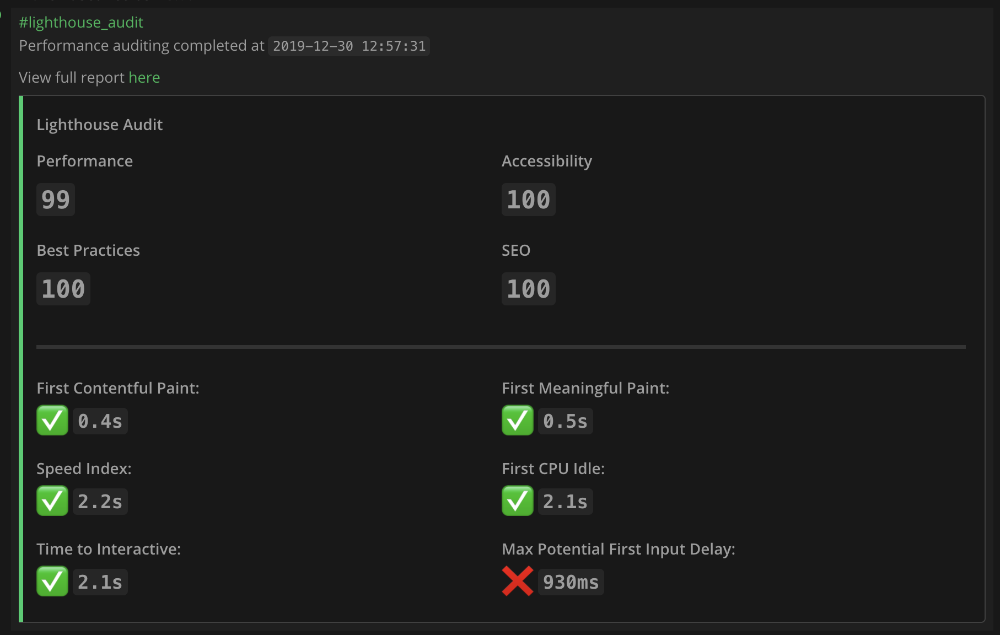
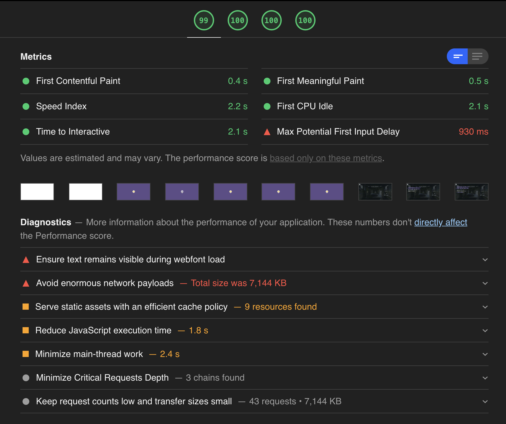

# Lighthouse Auditing Bot

## Table of Contents
* [Hackfest Proposal](#hackathon-proposal)
  * [Summary](#summary)
  * [Problem Statement](#problem-statement)
  * [Feature List](#feature-list)
  * [Use Cases](#use-cases)
  * [Approach](#approach)

## Hackfest Proposal
### **Summary**
This project seeks to provide added value to the Mattermost ecosystem by adding performance auditing of websites with Google's [Lighthouse](https://developers.google.com/web/tools/lighthouse), offering a testing environment that is accessible directly from any Mattermost channel.

### **Problem Statement**
* Website auditing is an often overlooked part of front-end development because of how difficult it is to integrate it to the developers' daily workflow
* Even when periodically used, auditing with Lighthouse can prove to be unreliable* when running on the client-side** because:
  * The internet speed on a given client can vary, causing significant variations in the following metrics:
    * [Time to interactive](https://developers.google.com/web/tools/lighthouse/audits/time-to-interactive)
    * [First Contentful Paint](https://developers.google.com/web/tools/lighthouse/audits/first-contentful-paint)
    * [First Meaningful Paint](https://developers.google.com/web/tools/lighthouse/audits/first-meaningful-paint)
  * Processes running in the background of a computer can have on impact on the results with regards to performance
* It's difficult to share the results of a performance audit with the rest of the team
* There's no current way to track performance over time

\* Performance tests are most reliable when minimizing the number of variables impacting their results  
\*\* Tests ran either through the Chrome developer tools' `audit` tab, or through the Lighthouse plugin on a browser

### **Use Cases**
* The development team uses a `/lighthouse https://siteurl.com` command to quickly run an audit of their website's performance, and have the results shared in Mattermost for all the team to see.  

  * A brief overview is displayed in-channel, with a link provided to a HTML template that displays the results of a given audit

* Running the `/lighthouse stats https://siteurl.com` to view the changes in performance over time as a chart
* Scheduling audit tasks for various sites that display the latest values, and the performance trend over time for a given site using `/lighthouse schedule` command and selecting options in a returned dialog

### **Approach**
The overall approach of this project is to create a private lighthouse testbed that is tightly integrated with Mattermost.
Offering a wide list of features that prioritize ease of usage.

#### **Feature List**
|      |     |
| :--: | :-- |
|  | Ad-hoc audit testing through slash commands |
|  | Scheduling of periodic audits (daily, or weekly) | 
|  | Viewing performance trends as charts directly from Mattermost | 
|  | Have access to the full report generated as HTML files by Lighthouse |

---

README icons downloaded from <a href="https://fontawesome.com/license">FontAwesome</a>